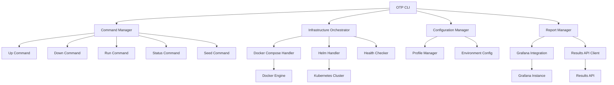

# Design Document

## Overview

The OTP CLI Foundation implements a Node.js-based command-line interface that orchestrates the Outeniqua Test Platform infrastructure and test execution. The CLI serves as the primary developer interface, abstracting complex Docker Compose and Helm operations while providing a consistent experience across local development, CI, and Kubernetes environments.

The design follows a modular architecture with clear separation between command handling, infrastructure orchestration, configuration management, and reporting integration. The CLI integrates with the broader OTP ecosystem through standardized APIs and configuration patterns.

## Architecture

### High-Level Components



### Technology Stack

- **Runtime**: Node.js 18+ with TypeScript
- **CLI Framework**: Commander.js for command parsing and help generation
- **Configuration**: Cosmiconfig for flexible configuration loading
- **Docker Integration**: Dockerode for Docker API interaction
- **Kubernetes Integration**: @kubernetes/client-node for Helm operations
- **HTTP Client**: Axios for API communication
- **Logging**: Winston for structured logging
- **Process Management**: Execa for spawning child processes

## Components and Interfaces

### Command Manager

The Command Manager handles CLI command parsing, validation, and routing to appropriate handlers.

```typescript
interface CommandManager {
  registerCommand(command: Command): void;
  executeCommand(args: string[]): Promise<CommandResult>;
  getHelp(commandName?: string): string;
}

interface Command {
  name: string;
  description: string;
  options: CommandOption[];
  handler: CommandHandler;
}

interface CommandResult {
  success: boolean;
  message?: string;
  data?: any;
  exitCode: number;
}
```

### Configuration Manager

Manages profile-based configuration loading and environment-specific settings.

```typescript
interface ConfigurationManager {
  loadConfig(profile?: string): Promise<OTPConfig>;
  validateConfig(config: OTPConfig): ValidationResult;
  getActiveProfile(): string;
}

interface OTPConfig {
  profile: 'local' | 'ci' | 'k8s';
  infrastructure: InfrastructureConfig;
  runners: RunnerConfig[];
  reporting: ReportingConfig;
  fixtures: FixtureConfig;
}

interface InfrastructureConfig {
  composeFiles: string[];
  helmChart?: string;
  namespace?: string;
  timeout: number;
  healthChecks: HealthCheckConfig[];
}
```

### Infrastructure Orchestrator

Handles deployment and management of the OTP infrastructure stack.

```typescript
interface InfrastructureOrchestrator {
  deployStack(config: OTPConfig): Promise<DeploymentResult>;
  destroyStack(config: OTPConfig, clean?: boolean): Promise<void>;
  getStackStatus(): Promise<StackStatus>;
  waitForHealthy(timeout: number): Promise<boolean>;
}

interface DeploymentResult {
  services: ServiceStatus[];
  endpoints: ServiceEndpoint[];
  deploymentTime: number;
}

interface ServiceStatus {
  name: string;
  status: 'running' | 'starting' | 'stopped' | 'error';
  health: 'healthy' | 'unhealthy' | 'unknown';
  ports: number[];
  logs?: string[];
}
```

### Test Runner Manager

Coordinates test execution across different runner types and environments.

```typescript
interface TestRunnerManager {
  runSuite(suite: string, options: RunOptions): Promise<TestResult>;
  listAvailableSuites(): Promise<string[]>;
  getRunnerStatus(suite: string): Promise<RunnerStatus>;
}

interface RunOptions {
  target: string;
  tags?: string;
  parallel?: boolean;
  timeout?: number;
  environment?: Record<string, string>;
}

interface TestResult {
  runId: string;
  suite: string;
  status: 'passed' | 'failed' | 'error';
  summary: TestSummary;
  artifacts: string[];
  traceId?: string;
}
```

### Report Manager

Integrates with Grafana and Results API for test reporting and dashboard access.

```typescript
interface ReportManager {
  openDashboard(runId?: string): Promise<void>;
  getLastRunId(): Promise<string | null>;
  publishResults(runId: string): Promise<void>;
  generateReport(runId: string, format: 'json' | 'html'): Promise<string>;
}

interface GrafanaIntegration {
  authenticate(): Promise<string>;
  buildDashboardUrl(runId?: string, filters?: DashboardFilters): string;
  validateConnection(): Promise<boolean>;
}
```

## Data Models

### Configuration Schema

```typescript
interface OTPConfig {
  version: string;
  profile: ProfileType;
  infrastructure: {
    compose: {
      baseFile: string;
      profileFiles: Record<ProfileType, string>;
      projectName: string;
    };
    helm?: {
      chart: string;
      namespace: string;
      values: Record<string, any>;
    };
    services: ServiceDefinition[];
    healthChecks: {
      timeout: number;
      retries: number;
      interval: number;
    };
  };
  runners: {
    [key: string]: RunnerDefinition;
  };
  reporting: {
    grafana: {
      url: string;
      auth?: AuthConfig;
      dashboards: DashboardConfig[];
    };
    resultsApi: {
      url: string;
      timeout: number;
    };
  };
  fixtures: {
    defaultSet: string;
    sets: Record<string, FixtureSet>;
  };
}
```

### Runtime State

```typescript
interface RuntimeState {
  activeProfile: ProfileType;
  stackStatus: StackStatus;
  lastRunId?: string;
  configPath: string;
  workspaceRoot: string;
}

interface StackStatus {
  deployed: boolean;
  services: ServiceStatus[];
  endpoints: ServiceEndpoint[];
  lastDeployment?: Date;
  version?: string;
}
```

## Error Handling

### Error Categories

1. **Configuration Errors**: Invalid or missing configuration files
2. **Infrastructure Errors**: Docker/Kubernetes deployment failures
3. **Network Errors**: Service connectivity issues
4. **Validation Errors**: Invalid command arguments or options
5. **Runtime Errors**: Unexpected failures during execution

### Error Handling Strategy

```typescript
class OTPError extends Error {
  constructor(
    message: string,
    public code: string,
    public category: ErrorCategory,
    public suggestions?: string[]
  ) {
    super(message);
  }
}

interface ErrorHandler {
  handleError(error: Error): CommandResult;
  suggestFix(error: OTPError): string[];
  logError(error: Error, context: any): void;
}
```

### Recovery Mechanisms

- **Automatic Retry**: For transient network and deployment issues
- **Graceful Degradation**: Continue with limited functionality when possible
- **Clear Diagnostics**: Provide actionable error messages and suggestions
- **State Recovery**: Detect and recover from partial deployments

## Testing Strategy

### Unit Testing

- **Command Handlers**: Test each command in isolation with mocked dependencies
- **Configuration Loading**: Validate config parsing and profile resolution
- **Infrastructure Operations**: Mock Docker/Kubernetes APIs for deployment testing
- **Error Scenarios**: Test error handling and recovery mechanisms

### Integration Testing

- **End-to-End Workflows**: Test complete command flows from CLI to infrastructure
- **Docker Compose Integration**: Validate stack deployment and health checking
- **API Integration**: Test Results API and Grafana connectivity
- **Cross-Platform**: Validate behavior on Windows, macOS, and Linux

### Test Structure

```typescript
describe('OTP CLI', () => {
  describe('Infrastructure Commands', () => {
    it('should deploy stack with local profile');
    it('should handle deployment failures gracefully');
    it('should validate service health after deployment');
  });
  
  describe('Test Execution', () => {
    it('should run test suites with proper configuration');
    it('should handle test failures and report results');
    it('should support tag-based filtering');
  });
  
  describe('Configuration Management', () => {
    it('should load profile-specific configurations');
    it('should validate configuration schemas');
    it('should handle missing configuration files');
  });
});
```

### Performance Testing

- **Startup Time**: CLI should initialize within 500ms
- **Deployment Speed**: Stack deployment should complete within 60 seconds locally
- **Memory Usage**: CLI should use less than 100MB RAM during normal operation
- **Concurrent Operations**: Support multiple simultaneous test runs

## Implementation Phases

### Phase 1: Core CLI Framework
- Command parsing and help system
- Configuration loading and validation
- Basic error handling and logging

### Phase 2: Infrastructure Orchestration
- Docker Compose integration
- Service health checking
- Stack lifecycle management

### Phase 3: Test Execution
- Runner integration and management
- Test result collection
- Progress reporting

### Phase 4: Reporting Integration
- Grafana dashboard integration
- Results API connectivity
- Report generation

### Phase 5: Advanced Features
- Helm/Kubernetes support
- Fixture management
- Performance optimization